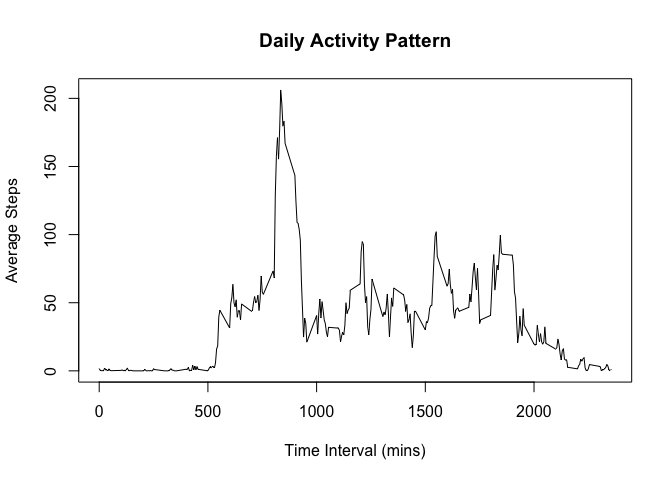

## Loading and preprocessing the data

```r
unzip("activity.zip")
rawData <- read.csv("activity.csv")
dataSample <- head(rawData)
print(str(rawData))
```

```
## 'data.frame':	17568 obs. of  3 variables:
##  $ steps   : int  NA NA NA NA NA NA NA NA NA NA ...
##  $ date    : chr  "2012-10-01" "2012-10-01" "2012-10-01" "2012-10-01" ...
##  $ interval: int  0 5 10 15 20 25 30 35 40 45 ...
## NULL
```

```r
print(dataSample, type="html")
```

```
##   steps       date interval
## 1    NA 2012-10-01        0
## 2    NA 2012-10-01        5
## 3    NA 2012-10-01       10
## 4    NA 2012-10-01       15
## 5    NA 2012-10-01       20
## 6    NA 2012-10-01       25
```


## What is mean total number of steps taken per day?


```r
library(dplyr)
```

```
## 
## Attaching package: 'dplyr'
```

```
## The following objects are masked from 'package:stats':
## 
##     filter, lag
```

```
## The following objects are masked from 'package:base':
## 
##     intersect, setdiff, setequal, union
```

```r
dailySteps <- rawData %>% group_by(date) %>% 
    summarise(total_steps = sum(steps, na.rm=TRUE))
hist(dailySteps$total_steps, main="Number of Steps per Day", xlab = "Step Count",
     ylab="Number of Days")
```

<!-- -->


```r
meanStepsPerDay <- mean(dailySteps$total_steps)
medianStepsPerDay <- median(dailySteps$total_steps)
```

The mean total number of steps per data is 9354.2295082.  
The median total number of steps per day is 10395.  

## What is the average daily activity pattern?


```r
intervalSteps <- rawData %>% group_by(interval) %>% 
    summarise(average_steps = mean(steps, na.rm=TRUE))
maxStepsInterval <- intervalSteps$interval[which.max(intervalSteps$average_steps)]
maxSteps <- round(max(intervalSteps$average_steps),0)
with(intervalSteps, plot(interval, average_steps, type="l",
                         main="Daily Activity Pattern", 
                         xlab="Time Interval (mins)",
                         ylab="Average Steps"))
```

<!-- -->

The 835th interval contains the most steps, 206.  

## Imputing missing values


```r
missingDataCount <- sapply(rawData, function(x) sum(is.na(x)))
print(missingDataCount, type="html")
```

```
##    steps     date interval 
##     2304        0        0
```

_Replace missing data with mean steps for the interval averaged accross the days_

```r
imputedData <- rawData
for (i in 1:dim(imputedData)[1]) {
    if (is.na(imputedData[i,"steps"])) {
        imputedData[i,"steps"] <- intervalSteps[intervalSteps$interval == imputedData[i, "interval"],
                                                "average_steps"]
    }
}
```


```r
imputedDailySteps <- imputedData %>% group_by(date) %>% 
    summarise(total_steps = sum(steps, na.rm=TRUE))
hist(imputedDailySteps$total_steps, main="Number of Steps per Day", xlab = "Step Count",
     ylab="Number of Days")
```

<!-- -->


```r
imputedMeanStepsPerDay <- mean(imputedDailySteps$total_steps)
rawMeanDiff <- round(imputedMeanStepsPerDay - meanStepsPerDay,0)
imputedMedianStepsPerDay <- median(imputedDailySteps$total_steps)
rawMedianDiff <- round(imputedMedianStepsPerDay - medianStepsPerDay,0)
```

The mean total number of steps per data is 1.0766189\times 10^{4}.
Difference from raw mean = 1412
The median total number of steps per day is 1.0766189\times 10^{4}. 
Difference from raw median = 371

Due to imputing, the totals will increase as initially the na will be ignored.

## Are there differences in activity patterns between weekdays and weekends?


```r
imputedDataWithWeekend <- imputedData %>% mutate(day = weekdays(as.Date(date))) 
imputedDataWithWeekend$weekendInd <- c('Weekday', 'Weekend')[(imputedDataWithWeekend$day) %in% c("Saturday", "Sunday") + 1L] 

intervalStepsImputedWithWeekend <- imputedDataWithWeekend %>% group_by(interval, weekendInd) %>% 
    summarise(average_steps = mean(steps))
```

```
## `summarise()` has grouped output by 'interval'. You can override using the `.groups` argument.
```


```r
library(ggplot2)
gplot <- ggplot(intervalStepsImputedWithWeekend, aes(interval, average_steps)) 
gplot + geom_line() + facet_grid(weekendInd ~ .) + labs(x = "Interval",
                                                        y = "Number of steps")
```

<!-- -->
